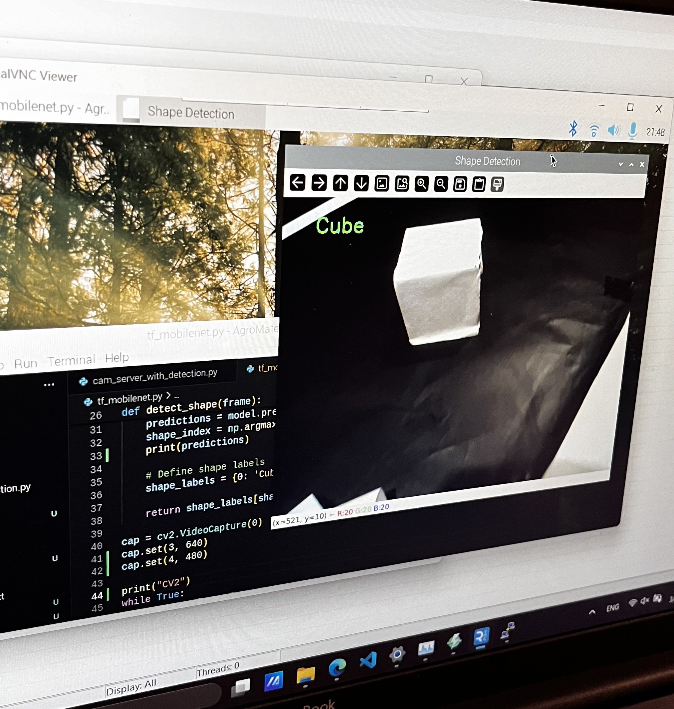
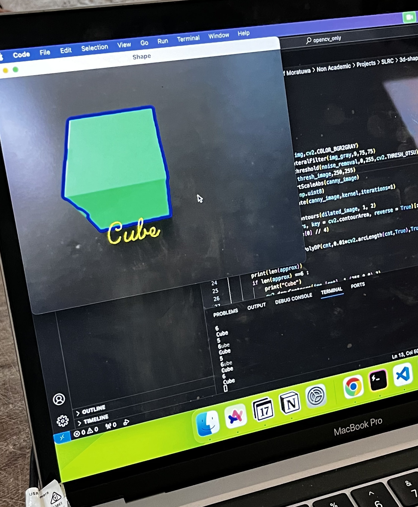

# Machine Vision System for Line Follower Robot (Sri Lanka Robotics Challenge 2024)
Computer Vision system for identifying 3D-objects and colors. Made for SLRC 2024. Powered by Tensorflow and OpenCV.

[](https://www.youtube.com/watch?v=JsFgmXSXnWw)


## Object Detection
One of the tasks of SLRC 2024 is for the robot to identify whether the object at the center of a ring is a cube or a cylinder. We tackled this task using computer vision. We experimented with the two approaches mentioned below. 

### Using Deep Learning
The robot includes a Raspberry Pi 4 Model B which runs a tensorflow model to inference. The video feed taken using a webcam is used for object classification. The deep learning model is trained using *MobileNetV1* as the base model with 2 dense layers attatched and trained using transfer learning. The training accuracy of this model reached 99%. 

The code for this technique can be found in `./object_detection` folder



### Using OpenCV edge detection
We also tried using OpenCV only to detect edges of the object in the center and generate contours. By hard-coding a specific number of contours as the threshold value, we can differentiate between the image of the cube and cylinder by comparing the number of contours generated. But we found this method is much more prone to errors. However the experimental code can be found in `./edge_detection`.



## Color Detection
Another task of SLRC 2024 is to identify the color of the wall infront of the line follower. Only two colors, green and blue, are possible. This could have been easily done with a color sensor module for Arduino. But since we have a camera fixed for the previous task, we implemented this functionality aslo from OpenCV. The code is much simpler and involves using two color masks for green and blue. Finally, the program counts the pixel area of green and blue seperately and outputs the color with the greater pixel area. The code for this task can be found in `./color_detection` folder.

## Final Driver Code
The final code running on the Raspberry Pi 4 Model B is included in the `main.py` file. This file consists of seperate functions `get_shape()` and `get_color()` which are called by the Raspberry Pi only when the Arduino Mega sends a request. The `main.py` file is run instantly after booting up the Raspberry Pi. 

## Technologies used
### Software
- Tensorflow and Keras
- OpenCV
- Google Colab to train the model
- Visual Studio Code

### Hardware
- Raspberry Pi 4 Model B
- Arduino Mega
- Hikvision Webcam

# Raspberry Pi 4 Model B Environment Setup

This guide will help you set up your Raspberry Pi 4 Model B to run a project using TensorFlow 2.15.0, Keras 2.15.0, OpenCV with contrib modules, and RPi.GPIO.


## Prerequisites

1. Raspberry Pi 4 Model B with Raspbian OS installed.
2. Internet connection.


## Step-by-Step Setup

### 1. Update System

First, ensure your system is up-to-date:

```sh
sudo apt-get update
sudo apt-get upgrade
```


### 2. Install Python and Pip

Make sure Python and Pip are installed:

```sh
sudo apt-get install python3 python3-pip
```


### 3. Install Dependencies

Install the dependencies:

```sh
pip install -r requirements.txt
```
### 4. Clone the Repository

Clone the repository to your Raspberry Pi:

```sh
git clone https://github.com/devnithw/SLRC-vision-system.git  
cd SLRC-vision-system
```

# Set Up `main.py` Script to Run at Raspberry Pi Startup

### 1. Create a systemd Service File:

Create a service file for your script:

```sh
sudo nano /etc/systemd/system/main.service
```

### 2. Add Service Configuration:

Paste the following content into the `main.service` file:

```ini
[Unit]
Description=Main Python Script for Vision System
After=multi-user.target

[Service]
Type=idle
ExecStart=/usr/bin/python3 /home/pi/Documents/SLRC-vision-system/main.py

[Install]
WantedBy=multi-user.target
```
* In the `[Service]` section, the `ExecStart` directive specifies the command to execute when starting the service. The first part of the ExecStart value should be the directory where your Python interpreter is installed, and the second part should be the path to your target script file.
* For example, ExecStart=/usr/bin/python3 /home/pi/Documents/main.py indicates that Python is installed in /usr/bin/ and the target script is located at /home/pi/Documents/main.py.

### 3. Save and Enable the Service:

Save the file and close the editor. Then, enable the service:

```sh
sudo systemctl enable main.service
```

### 4. Start the Service Manually (Optional):

To run the script immediately without rebooting:

```sh
sudo systemctl start main.service
```

### 5. Check the Service Status:

Verify the service is running:

```sh
sudo systemctl status main.service
```

### 6. Stop the Service (Optional):

To temporarily stop the service:

```sh
sudo systemctl stop main.service
```

### 7. Verify Service Startup at Boot:

Ensure the service is configured to start automatically on boot:

```sh
sudo systemctl is-enabled main.service
```

This command should return `enabled` if the service is set to start at boot.

**With these steps, your Python script `main.py` will now automatically run whenever the Raspberry Pi boots up.**


# About

This project was developed for the `SLRC 2024- Sri Lankan Robotics Challenge`

## Contributing

Contributions are welcome! 

- **Bug Fixes:** If you find any bugs or issues, feel free to create an issue or submit a pull request.
- **Feature Enhancements:** If you have ideas for new features or improvements, don't hesitate to share them.

# License

This project is licensed under the [MIT License](LICENSE).
